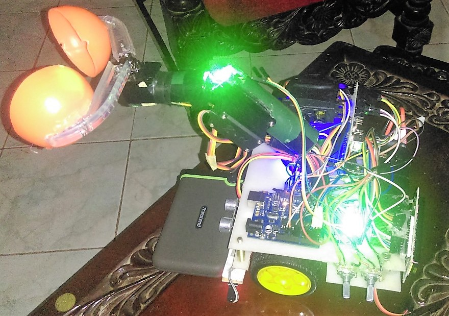

# echo-bot
## Introduction
Simple garbage collecting line following bot using arduino UNO board. 

## Overview

## Contributers

<table>
<tr>

<td align="center"></td>
<td align="center"></td>
<td align="center"></td>
<td align="center"></td>
</tr>
<tr>

<td align="center"><a href="https://github.com/AsithaIndrajith">Asitha Indrajith</a></td>
<td align="center"><a href="https://github.com/Sacheerc">Sachintha Rathnayake</a></td>
<td align="center"><a href="https://github.com/pasindumadusanka95">Pasindu Madusanka</a></td>
<td align="center"><a href="https://github.com/manjitha-teshara">Manjitha Teshara</a></td>

</tr>
</table>
